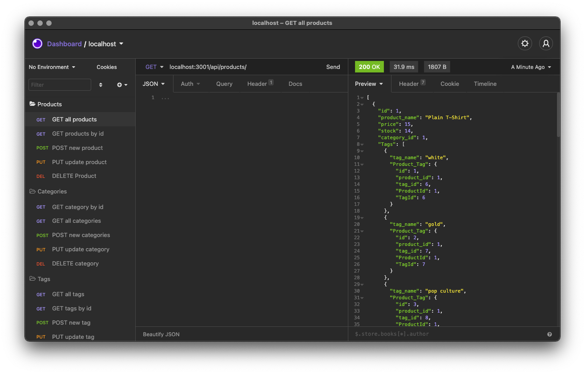

# E-Commerce Back End

## Description
    This is the back end for an e-commerce site. 
    This back end uses an Express.js API that uses sequalize to interect with a MySQL database.
    Check out my walk through video and screeshot below! Click on the "Demo" link!

## Installation
    npm install
    node run seed

## Deployment
    node server.js    

## Video Demo

[Demo](https://drive.google.com/file/d/14eisO-nONERdTPu348h5-JTYkATiLPgt/view?usp=sharing)
Click "Demo" for video demo. 

## License

## Screenshots of README Generator Functionality

